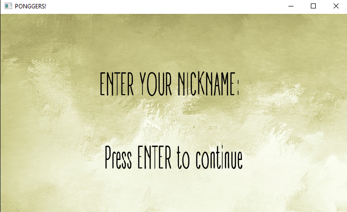
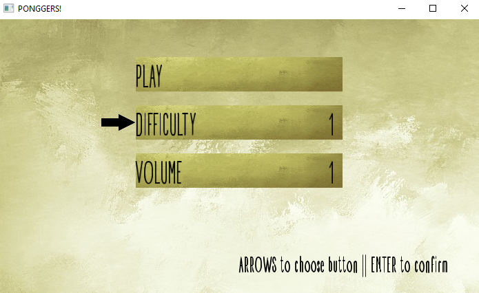
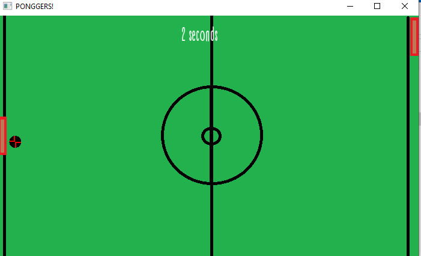
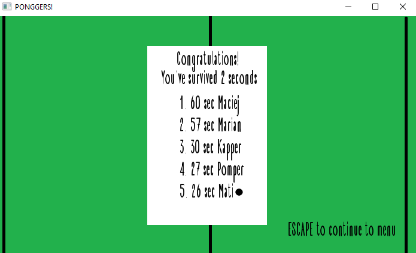

# Sfml/c++ project
### This is a simple game created in c++ graphic library (sfml).
## Game contains: 
* Start screen where you have to type your nickname

* Main menu with options to change game difficulty and volume

* Playground based on an indea of pong 

* Highscore label with own nicknames

